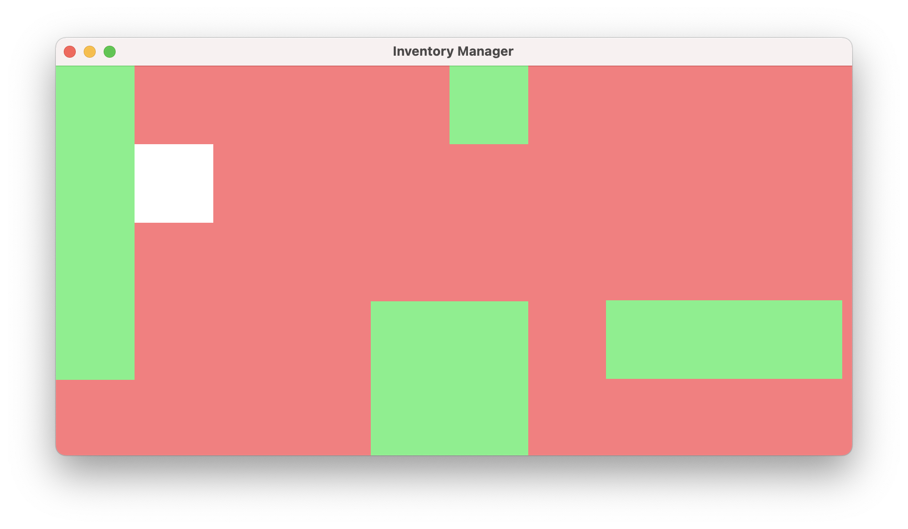

# InventoryManager

Resident Evil 4 / 8 inventory system recreated in MonoGame

Controls :

    ArrowLeft : Move left (pointer or item)
    ArrowRight : Move right (pointer or item)
    ArrowUp : Move up (pointer or item)
    ArrowDown : Move down (pointer or item)
    R : Rotate item
    Enter : Select/Unselect
    Space : Cancel selection (and moving / rotation)
    Esc : Quit

*N.B Pointer is white, Inventory is coral, Items are green, Window background is blue.*

*N.B GameWindow is just a sample, Image Texture2D not yet tested*

## Getting started

Open `.sln` in Visual Studio.

*Pre-requisite : MonoGame tools installed, more information [here](https://docs.monogame.net/articles/getting_started/0_getting_started.html).*